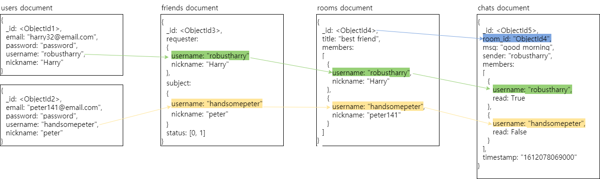

## how to run current version?
localhost:5000/chat/<chatroom_id>

# socketio - flask 연습

## 개요

flask, sokcetio를 사용하여 만드는 채팅 서비스 입니다

아래 기술을 사용하였습니다
> flask
> socketio
> mongodb
> jwt

스키마 설명

username: 친구 검색을 위해 사용되는 값입니다

firends 스키마는 requester와 subject관계로 저장합니다. 
requester는 subject를 원하는 이름으로 저장할 수 있고, subject는 requester가 추천됩니다
subject가 requester의 친구 추천을 수락하면 status를 1로 표시하여 더 이상 추천하지 않습니다

rooms는 members와 title로 구성됩니다.
title 변경은 누구나 가능하지만, 구성원을 내보낼 수는 없습니다

chats는 username과 read를 가지고 있는데, 
클라이언트는 로컬에 저장된 friends리스트에서 username에 해당하는 nickname이 있다면 그 이름을 매핑해서 보여주고, 
만약, friends 리스트에 해당 유저가 없다면 로컬에 저장된 rooms에서 기본 nickname을 매핑해서 보여줍니다

read는 읽은 경우 true로 바꿔주며, 자신이 member로 들어있지 않은 메시지라면 읽을 수 없습니다. 즉, 자신이 들어오기 전에 주고 받은 메시지는 읽을 수 없습니다
